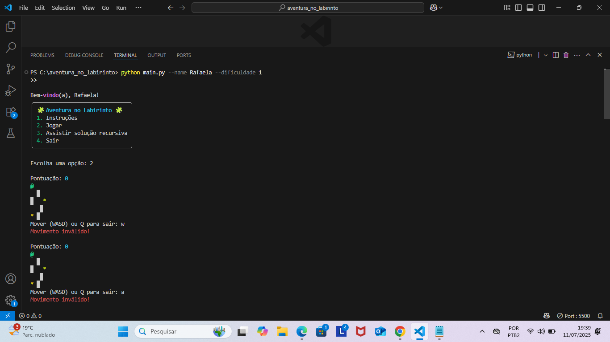
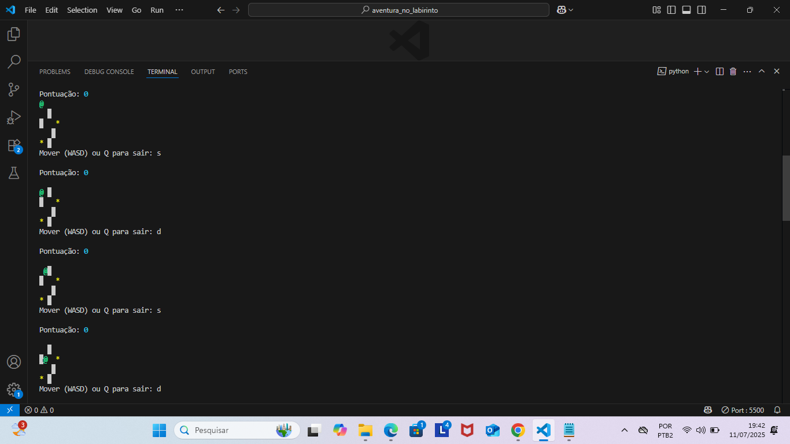
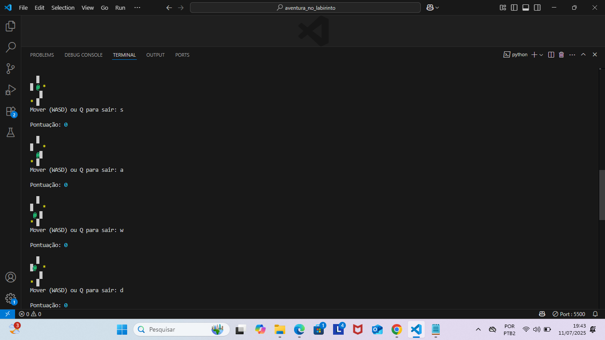
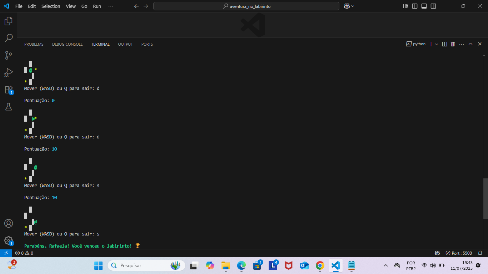
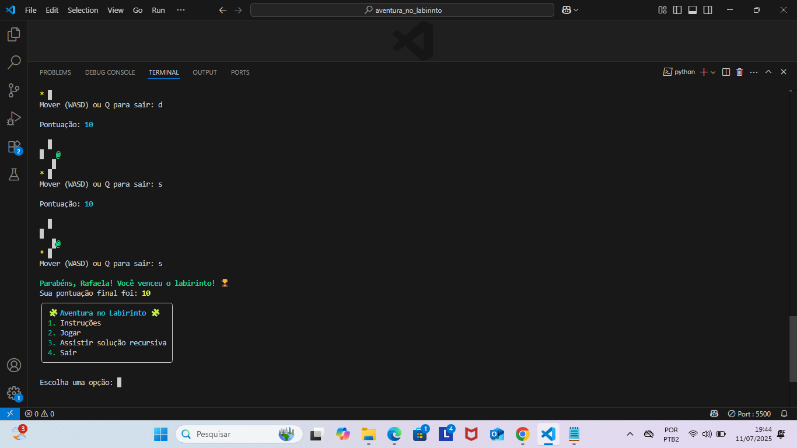

# 🧩 Aventura no Labirinto

Bem-vindo(a) ao jogo **Aventura no Labirinto**!

Um jogo de terminal em Python onde você explora um labirinto gerado aleatoriamente, coleta itens e tenta encontrar a saída. Desenvolvido como Trabalho Prático I do curso de Python Básico da PretaLab.

## 🎮 Como Jogar

Você controla o personagem com as teclas:

- `W`: cima  
- `A`: esquerda  
- `S`: baixo  
- `D`: direita  
- `Q`: sair do jogo  

Seu objetivo é chegar até o canto inferior direito do labirinto, coletando itens (`*`) e desviando de paredes (`█`).   

---

## 🧠 Funcionalidades

- Labirintos gerados dinamicamente com 3 níveis de dificuldade  
- Pontuação baseada na coleta de itens  
- Animação automática da solução com uma função recursiva  
- Interface interativa com a biblioteca `rich`  
- CLI (linha de comando) com `argparse`

---

## ▶️ Como Executar

1. Clone o repositório e entre na pasta:

```bash
git clone https://github.com/RafaelaKeyse/aventura_no_labirinto.git
cd aventura_no_labirinto

# Dentro da pasta do projeto
python -m venv venv
venv\Scripts\activate

# Instale as dependências
pip install -r requirements.txt

# Rode o jogo
python main.py --name Rafaela --dificuldade 1

╭───────────────────────────────╮
│ 🧩 Aventura no Labirinto 🧩   │
│ 1. Instruções                 │
│ 2. Jogar                      │
│ 3. Assistir solução recursiva │
│ 4. Sair                       │
╰───────────────────────────────╯

Pontuação: 10
@  *  █
   █
*  █


🛠 Requisitos
Python 3.10 ou superior

Terminal com suporte a Unicode (símbolos e cores)

🧠 Créditos
Desenvolvido por Rafaela Keyse
Projeto do curso Python Básico - PretaLab 💜


## Demonstração do Jogo

Veja algumas telas do jogo em ação:


*Menu inicial do jogo*


*Movimentando pelo labirinto*


*Coletando itens para pontuar*


*Quase lá!*


*Parabéns! Você venceu o labirinto!*
